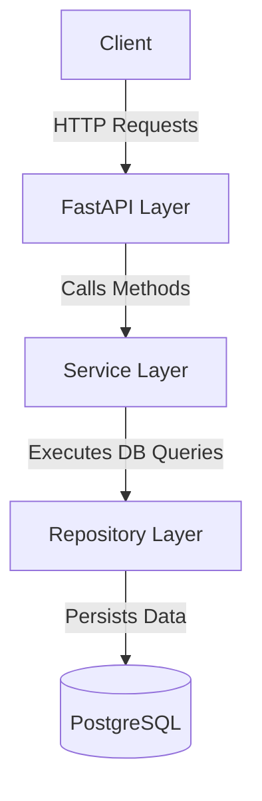
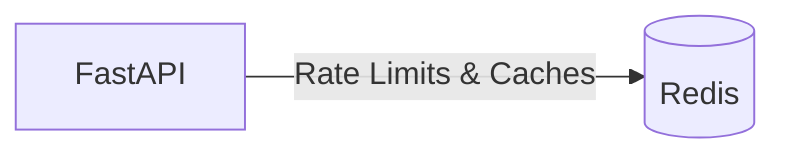

# Architecture Documentation

This document describes the architectural flow and design choices behind the ShortLink Analytics API.

## Core Flow

The system employs a layered architecture separating concerns between network handling, business logic, and data access. 

- **FastAPI**: Handles HTTP routing, request/response validation (via Pydantic), Rate Limiting, and Dependency Injection.
- **Service Layer**: Houses core business logic. Modules like `LinkService` and `AnalyticsService` coordinate caching and database orchestration.
- **Repository Layer**: Consolidates raw database queries (using `SQLAlchemy 2.0`) isolating business logic from storage mechanics.
- **PostgreSQL**: The source-of-truth relational database storing Users, Links, and Click Analytics.

## Redis Cache & Rate Limiting

Redis is introduced to handle high-frequency reads and prevent abuse without overwhelming the primary database.

### 1. Redis Caching Flow
When a user visits a short link:
1. `GET /{short_code}` is invoked.
2. The `LinkService` attempts to resolve the URL from Redis.
3. If it is a Cache Hit, the original URL is returned immediately.
4. If it is a Cache Miss, the `LinkRepository` fetches the URL from PostgreSQL, writes it into Redis, and returns the response.

### 2. Redis Rate Limiting Flow
The `RateLimiter` is injected directly into FastAPI routes as a Dependency (`Depends()`).
Using a Redis pipeline, the API checks the number of requests made by the client's IP in a rolling window. If it exceeds the limit, a `429 Too Many Requests` is raised. 

*Resilience Note*: The API is designed to fail-open. If the connection to Redis fails, `RedisError` is gracefully handled, and rate limits are temporarily bypassed rather than crashing the API.

## Authentication Flow

Authentication is built using standard OAuth2 Bearer Tokens (JWT).
1. A user posts credentials to `/api/v1/auth/login`.
2. The API hashes the password using `bcrypt` and verifies it.
3. A PyJWT token is generated and returned to the user.
4. For protected endpoints, the token is verified using `fastapi.security.OAuth2PasswordBearer`.

## Short-Link and Analytics Flow

The redirection flow prioritizes speed and delegates the heavy lifting of analytics to background execution.

1. Client requests a redirect.
2. FastAPI triggers the redirect logic via `LinkService` returning an HTTP `307 Temporary Redirect` instantly.
3. Simultaneously, `BackgroundTasks` executes `AnalyticsService.record_click()`.
4. `AnalyticsService` sanitizes the IP address, User-Agent, and Referrer data, and asynchronously records it into the PostgreSQL Analytics table.
